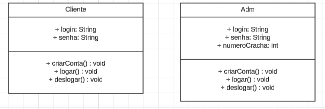
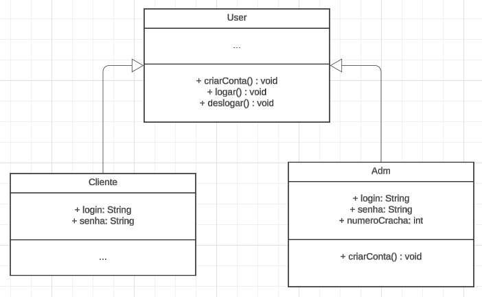

## Descrição de Problema

Temos um sistema de login e cadastro de usuários para clientes e administradores (adm). Identificamos que ambos seguem o mesmo fluxo: login, logout e cadastro.

No entanto, para cadastrar um administrador, é necessário inserir o número de crachá. Para lidar com isso, aplicamos o método template, criando uma classe abstrata **User** com os métodos **logar**, **criarConta** e **deslogar**. Em seguida, criamos duas classes filhas: **Adm** e **Cliente**.

A classe **Adm** sobrescreve o método **criarConta** para adicionar o atributo número de crachá. Já a classe **Cliente** não sobrescreve nenhum método.

Essa versão ajusta a fluidez da linguagem e corrige pequenas inconsistências.

## Diagrama sem template

## Diagrama com template

